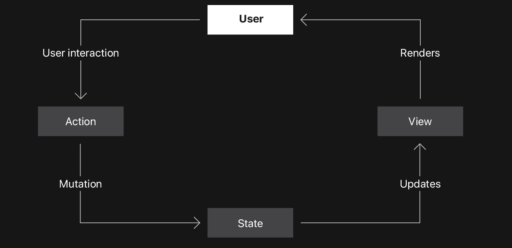
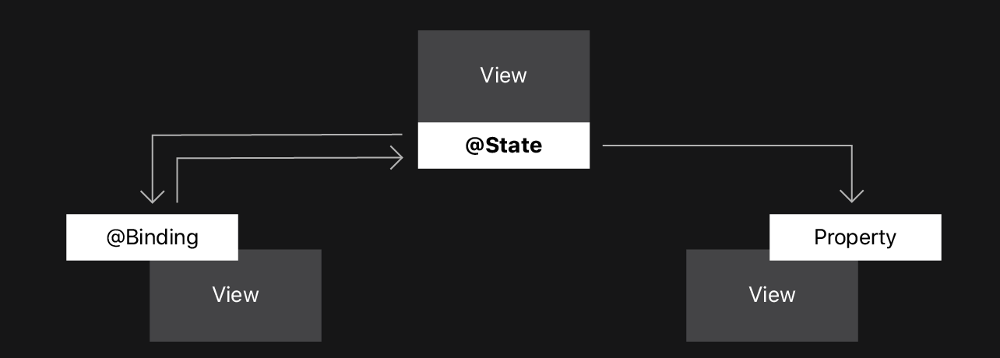
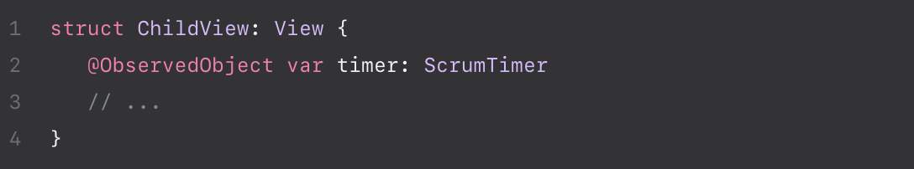
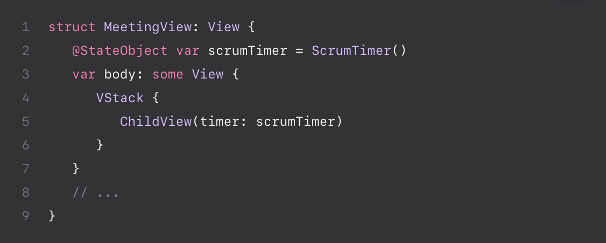
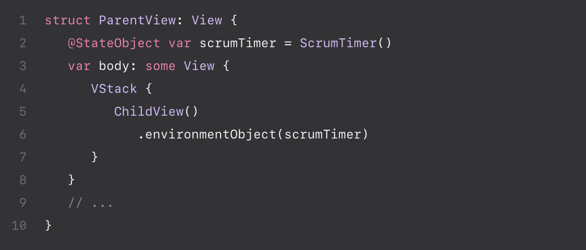
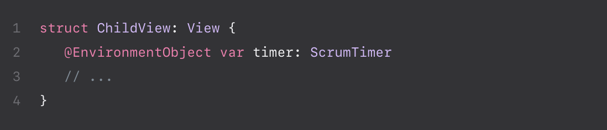

# MANAGING DATA FLOW BETWEEN VIEWS

### Source of Truth
- Việc duy trì nhiều bản sao thông tin có thể tạo ra sự mâu thuẫn 
dẫn đến bug.
- Để tránh lỗi không nhất quán dữ liệu, dùng một ***source of truth*** duy nhất cho mỗi thành phần dữ liệu trong app.
- Store phần tử ở 1 location - the source of truth - và nhiều Views có thể truy cập đến cùng 1 dữ liệu.

### Swift Property Wrappers
- Giúp thêm hành vi vào các thuộc tính hiệu quả.
- @State và @Binding giúp maintain single source of truth cho dữ liệu.

### State
- Khi khai báo 1 thuộc tính như 1 @State, tạo 1 source of truth ở trong view.
- Hệ thống xác định tất cả các thành phần của một View phụ thuộc vào giá trị của @State property.
- Những tương tác của User phải thay đổi @State property.
- Hệ thống render new version của UI bằng cách cập nhật những view nào phụ thuộc vào property đó.

### Binding
- Một thuộc tính được wrap với @Binding chia sẻ quyền đọc và ghi với 1 source of truth đang tồn tại, như 1 @State property.
- Một @Binding không lưu trữ trực tiếp dữ liệu.
- Thay vào đó nó tạo một two-way connection giữa 1 source of truth và 1 view dùng để hiển thị và cập nhật dữ liệu.
- This connection chắc chắn rằng nhiều views liên kết với một phần dữ liệu được đồng bộ.

- Hệ thống thiết lập những phụ thuộc giữa data trong @State và Child View chứa @Binding. Parent View và Child View có thể thay đổi thuộc tính source of truth. Framework tự động update cả 2 view thể phản ánh những thay đổi

# MAKING CLASSES OBSERVABLE

### Working with reference types
- @State attribute chỉ làm việc với value types, chẳng hạn như struct (immutable) và enum
- SwiftUI cung cấp những property wrappers khai báo 1 reference type như 1 source of truth
- @ObservedObject, @StateObject và @EnvironmentObject
- Để dùng những property wrappers với class, cần **make class observable**

### Making a class observable
- Dùng **ObservableObject** protocol
- Chọn những thuộc tính cần trigger để UI update khi có thay đổi. Sau đó thêm **@Published** attribute cho những properties đó

### Monitoring an object for changes
- Để monitor 1 observable object cần thêm 1 trong những attributes: **ObservedObject**, **StateObject**, hoặc **EnvironmentObject**
- @StateObject tạo 1 observable object trong 1 view. System khởi tạo object khi tạo view, và nó giữ object available để dùng trong chính view đó hoặc trong những views được truyền nó.

- Dùng @ObservedObject cho object được truyền từ một view khác
- Do đã tạo object ở view khác nên không cần cung cấp inital value cho một ObservedObject

- Sau đó truyền 1 instance của observable object đến view

- Thay vì truyền object trực tiếp vào views, có thể đặt object vào environment. **environmentObject()** modifier đặt 1 object trong environment ở parent view. Sau đó bất kì view ancestor(tổ tiên) có thể truy cập vào object

- Sau đó dùng @EnvironmentObject để truy cập vào object trong bất kì descendent(con cháu) của parent view ngay cả khi các view trung gian không có tham chiếu đến object. SwiftUI chỉ theo dõi sự phụ thuộc trong những view dùng dữ liệu đó.

